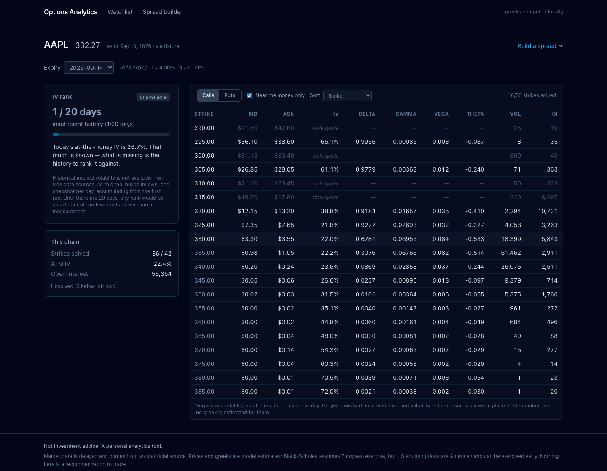
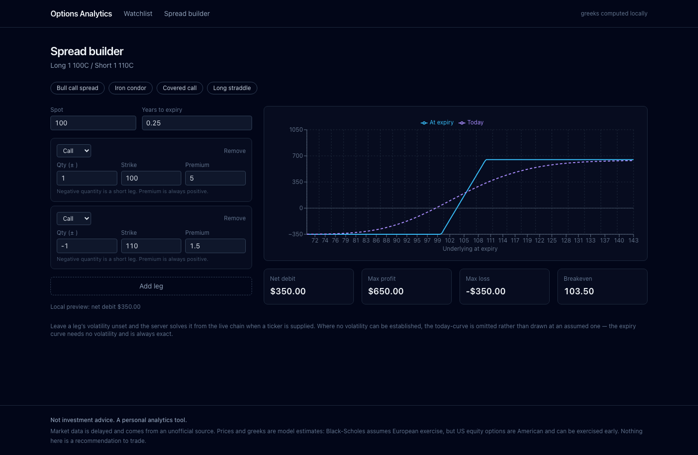

# Options & Markets Analytics

[](https://github.com/Tejas12972/stockwatchlist/actions/workflows/ci.yml)
[](#tests)
[](https://www.python.org/)
[](LICENSE)

A personal options-analytics tool. Option chains with **Black-Scholes greeks and
implied volatility computed locally**, and an IV-rank history the tool builds
itself by snapshotting chains daily.



> Not investment advice. A personal analytics tool, built for my own use.

Two details in that screenshot are the whole project. Every greek in the table
was computed here rather than read from the data vendor. And the IV-rank panel
says **"insufficient history (1/20 days)"** instead of showing a number — because
on day one there is no honest rank to show, and a zero would read as "volatility
is at its lows".

---

## Why I built it

I trade options, and the thing I actually want to look at — where today's implied
volatility sits against its own recent history — is not something a free data
source will give you. So this tool computes the analytics from first principles
and accumulates the history it needs.

Two design decisions drive the whole project:

**I compute the greeks rather than reading the vendor's columns.** Yahoo ships a
`delta` and an `impliedVolatility` field. This tool ignores both. Prices come
from the provider; Black-Scholes-Merton pricing, all five greeks, and the implied
volatility solve all happen in `api/options_tool/analytics/`. The provider's data
classes have nowhere to put a vendor greek, so the rule is enforced by the type
definitions rather than by discipline.

**I build the IV history instead of faking it.** IV rank needs historical implied
volatility, and free APIs do not provide it. Rather than substitute realised
volatility and call it the same thing, the tool runs a daily snapshot job that
writes the full chain — including its own computed IV — to SQLite. History
accumulates from day one forward. Until there are enough stored days, IV rank
returns `null` and a reason, and the UI says *"insufficient history (3/20 days)"*
rather than rendering a misleading zero.

---

## Status

| Milestone | State |
|---|---|
| M1 — core analytics (pricing, greeks, IV solver, chain normalisation, CLI) | done |
| M2 — persistence + daily snapshots + IV rank | done |
| M3 — FastAPI | done |
| M4 — tests + CI | done |
| M5 — Next.js front end | done |
| M6 — Docker + deployment | Fly.io, private API + authenticated front end |
| M7 — polish (earnings flag, screener, CSV export) | done |

---

## Setup

Requires Python 3.11+.

```bash
git clone https://github.com/Tejas12972/stockwatchlist.git
cd stockwatchlist/api

python3.11 -m venv .venv
.venv/bin/pip install -e ".[dev]"

cp ../.env.example ../.env     # optional; every setting has a working default
```

### Use it

```bash
# Live chain with self-computed greeks
.venv/bin/python -m options_tool chain AAPL --expiry 2027-01-15

# Only near-the-money calls
.venv/bin/python -m options_tool chain SPY --right call --near-the-money 5

# Offline, from the checked-in capture -- works when Yahoo is throttling
.venv/bin/python -m options_tool --provider fixture chain AAPL

.venv/bin/python -m options_tool expiries AAPL
.venv/bin/python -m options_tool quote SPY
```

### Build the IV history

```bash
.venv/bin/python -m options_tool watchlist --add SPY AAPL
.venv/bin/python -m options_tool snapshot     # run this daily
.venv/bin/python -m options_tool ivrank
```

`snapshot` is idempotent — running it twice in one day refreshes that day's rows
rather than appending a second copy:

```
$ options-tool snapshot
AAPL 2026-09-13: captured 368 contracts across 3 expiries (94% solved), 30d ATM IV 26.7%
SPY  2026-09-13: captured 754 contracts across 3 expiries (85% solved), 30d ATM IV 14.6%
stored contract rows: 0 -> 1122

$ options-tool snapshot
AAPL 2026-09-13: refreshed 368 contracts across 3 expiries (94% solved), 30d ATM IV 26.7%
SPY  2026-09-13: refreshed 754 contracts across 3 expiries (85% solved), 30d ATM IV 14.6%
stored contract rows: 1122 -> 1122
```

On a fresh database IV rank says so rather than inventing a number:

```
$ options-tool ivrank
AAPL     IV rank unavailable: insufficient history (1/20 days) (ATM IV 26.7%)
SPY      IV rank unavailable: insufficient history (1/20 days) (ATM IV 14.6%)
```

```
                       SPY 2026-09-14  spot 764.29  T 0.0050y  r 4.00%
┏━━━━━━━┳━━━━━━━━┳━━━━━━━┳━━━━━━━┳━━━━━━━┳━━━━━┳━━━━━━━┳━━━━━━━━━┳━━━━━━━━━┳━━━━━━━━┳━━━━━━━━━┓
┃ right ┃ strike ┃   bid ┃   ask ┃   mid ┃ src ┃    IV ┃   delta ┃   gamma ┃   vega ┃  th/day ┃
┡━━━━━━━╇━━━━━━━━╇━━━━━━━╇━━━━━━━╇━━━━━━━╇━━━━━╇━━━━━━━╇━━━━━━━━━╇━━━━━━━━━╇━━━━━━━━╇━━━━━━━━━┩
│ put   │ 750.00 │  0.13 │  0.14 │  0.14 │ mid │ 15.5% │ -0.0399 │ 0.01031 │  4.633 │ -0.1948 │
│ put   │ 760.00 │  0.73 │  0.74 │  0.73 │ mid │ 10.8% │ -0.2201 │ 0.05107 │ 15.949 │ -0.4554 │
│ put   │ 765.00 │  2.20 │  2.23 │  2.21 │ mid │  8.9% │ -0.5448 │ 0.08227 │ 21.348 │ -0.4812 │
│ put   │ 770.00 │  5.76 │  5.84 │  5.80 │ mid │  8.4% │ -0.8888 │ 0.04186 │ 10.203 │ -0.1615 │
└───────┴────────┴───────┴───────┴───────┴─────┴───────┴─────────┴─────────┴────────┴─────────┘
        6/6 strikes solved (100%) · greeks computed locally, not vendor-supplied
```

### Run the API

```bash
cd api
.venv/bin/uvicorn options_tool.api.main:app --reload
```

Interactive docs at <http://localhost:8000/docs>.

| Endpoint | Purpose |
|---|---|
| `GET /health` | liveness, plus whether the DB and provider are reachable |
| `GET /watchlist`, `POST /watchlist`, `DELETE /watchlist/{ticker}` | tracked symbols |
| `GET /quote/{ticker}` | spot |
| `GET /chain/{ticker}` | full chain with self-computed greeks |
| `GET /ivrank/{ticker}` | IV rank, or `null` plus a reason |
| `POST /snapshot/{ticker}` | capture today's chains (idempotent) |
| `POST /payoff` | multi-leg P/L at expiry **and** today |

Errors are typed, never a bare 500. An unlisted expiry returns the ones that do
exist so the client can correct itself in one round trip:

```json
{
  "code": "expiry_not_found",
  "message": "AAPL: no listed chain for expiry 1999-01-01. Available: 2026-09-14, 2027-01-15, 2028-12-15",
  "detail": { "available_expiries": ["2026-09-14", "2027-01-15", "2028-12-15"] }
}
```

`POST /payoff` solves each leg's implied volatility from the live chain when you
do not supply one, and returns both curves. Extremes are computed analytically
rather than read off the plotted grid, so `"max_loss": null` means genuinely
unlimited — and a long put's profit is correctly reported as large but finite,
because the underlying cannot fall below zero.

### Run the front end

```bash
cd web
npm install
NEXT_PUBLIC_API_BASE_URL=http://localhost:8000 npm run dev
```

Three pages: a watchlist showing how much history each symbol has accumulated, a
chain view, and a spread builder.



The payoff maths exists twice — once in Python, once in TypeScript — so the
builder redraws instantly while you edit a leg instead of waiting on a request
per keystroke. That is exactly the setup where two implementations quietly drift
apart, so **both are tested against the same golden fixture**
(`api/tests/fixtures/payoff_golden.json`, generated by the Python engine and read
by the vitest suite). If they ever disagree, CI goes red.

---

## How the IV history works

This is the part of the project I find most interesting, because the data simply
does not exist to be downloaded.

IV rank needs a history of implied volatility. Free providers give you today's
chain and nothing else, and the historical-IV products that do exist are paid.
The two dishonest ways out are to substitute realised volatility (a different
quantity that answers a different question) or to render a rank from three days
of data and hope nobody asks. This tool does neither: it runs a daily job that
captures the full chain, computes every contract's IV, and writes the lot to
SQLite. The history is one the tool builds for itself, starting empty.

**Reducing a day to one number.** IV rank needs a single scalar per day, and
"the IV of some strike" will not do — as spot drifts, a fixed strike slides along
the skew, and as days pass the front expiry rolls, so the series would move for
reasons unrelated to volatility. Instead each day is reduced to a **30-day
constant-maturity at-the-money IV**: interpolate to the at-the-money strike
within each expiry, then interpolate across expiries *in total variance* to a
30-day horizon. Variance rather than volatility because variance is what is
additive in time. If 30 days cannot be bracketed by the listed expiries, the day
stores `null` and is excluded — extrapolating would invent a number, and on an
early day an invented number becomes the historical minimum for a year.

**Idempotency is a database guarantee, not a convention.** Unique constraints on
`(ticker_id, snapshot_date)` and `(snapshot_id, expiry, strike, right)` make the
tuple `(ticker, date, expiry, strike, right)` unique by construction, and the
writer uses `INSERT ... ON CONFLICT DO UPDATE`. A cron timer that fires twice, a
retried half-failure, or a manual re-run all refresh the day instead of
double-weighting it in the rank window.

**Storing the assumptions with the data.** Each snapshot records the risk-free
rate and dividend yield in force when it was captured. Without them a stored IV
is uninterpretable later — you could not distinguish a real volatility move from
a change to the tool's own configuration.

**Rank and percentile, not just rank.** IV rank places today between the window's
extremes; IV percentile reports the share of days below today. Percentile is the
more robust of the two — a single outlier day sets the range that rank is
measured against, but moves percentile by one observation. Both are reported.

---

## How the analytics work

**Pricing** is Black-Scholes-Merton with a continuous dividend yield. Delta,
gamma, vega, theta and rho are the analytic partial derivatives, returned in raw
per-unit terms (`Greeks.theta_per_day` and `.vega_per_point` scale them for
display).

**Implied volatility** is solved numerically: Newton-Raphson on vega, with a
bisection fallback for the contracts where Newton misbehaves — deep in- and
out-of-the-money strikes where vega underflows and the update step explodes.
Bisection cannot diverge, so the wings still solve; across a test surface
spanning 1e-4 to 5.0 volatility and 0.0001 to 2 years, round-trip error is under
4e-9.

**Every failure returns `None` with a reason**, never a number:

| Status | Meaning |
|---|---|
| `expired` | contract has expired; its price implies no future volatility |
| `no_quote` | no usable bid/ask or last price |
| `non_positive_price` | quoted price is zero or negative |
| `below_intrinsic` | price is below intrinsic value — quote is stale or crossed |
| `above_max` | price exceeds the no-arbitrage maximum |
| `no_bracket` | no volatility in [0.0001, 5] reproduces this price |
| `not_converged` | solver ran out of iterations |

Strikes that fail are kept in the table, greyed out and labelled. A strike that
cannot be priced is information, so it is shown rather than dropped.

---

## Tests

547 Python tests and 48 TypeScript tests. **The Python suite runs with no network at all**, which is enforced rather
than intended: `pytest-socket` is configured with `--disable-socket`, so any
accidental outbound call fails the test that made it. `tests/test_offline.py`
asserts the block is actually in place, so the guarantee cannot rot quietly if
someone edits the config.

```bash
cd api
.venv/bin/pytest                      # offline; sockets are blocked
.venv/bin/pytest --cov=options_tool   # with coverage
.venv/bin/pytest -m network           # opt in to live-vendor tests
.venv/bin/ruff check . && .venv/bin/mypy options_tool
```

| Module | Coverage |
|---|---|
| `analytics/` (pricing, IV, IV rank, payoff, screener) | **97%** |
| whole package | 93% |

CI enforces ≥85% overall and ≥90% on `analytics/` — a gate, not a number typed
into a README.

What the suite actually checks, beyond line coverage:

- **Greeks two independent ways** — against published reference values, *and*
  against finite differences of this project's own pricer. A formula can match a
  textbook while being wired to the wrong function; a greek can match finite
  differences while being the wrong formula. Both together leave little room.
- **Put-call parity** across spots, maturities and dividend yields.
- **IV round-trips** over the whole surface: σ from 1e-4 to 5, T from 1e-4 to 2
  years, both rights, including the wings where Newton hands off to bisection.
- **Every solver edge case returns `None`** with a named reason — expired, zero
  bid, below intrinsic, above the no-arbitrage maximum, non-finite input.
- **Snapshot idempotency**, checked from both ends: that re-running holds the row
  count, and that the database rejects a duplicate even with the upsert bypassed.
- **The market date, not the UTC date** — a job run at 20:30 Eastern must file
  under the same trading day as one at 15:00.
- **Payoff against hand-computed values** for eleven structures, plus a golden
  file shared with the TypeScript suite so the two implementations cannot drift.
- **No vendor greek can cross the provider boundary** — asserted structurally by
  checking `OptionQuote` has no field one could be stored in.
- **The vendor's failure modes**, against a fake `yfinance`: throttling is
  retried and reported as retryable, a schema change fails fast, NaN becomes
  `None`, and a strike-less row is dropped.

---

## Screener and export

```bash
options-tool screen                    # flag watchlist symbols where something changed
options-tool screen --earnings         # also check earnings proximity (live requests)
options-tool export --out history.csv  # one row per stored day
options-tool export AAPL --what contracts --out chains.csv
```

The screener runs entirely on stored history, so it never touches the vendor and
cannot be throttled. It flags elevated or depressed IV rank, and volume or open
interest well above its own trailing **median** — median rather than mean because
option volume is spiky, and one expiry-week spike would drag a mean upward for
weeks afterwards.

It is descriptive. It narrows a watchlist; it does not rank opportunities or
suggest positions. And it reports how many symbols it screened alongside the
hits, because an empty result could otherwise mean "nothing was flagged" or
"nothing could be checked" — two very different things:

```
$ options-tool screen
screened 2 symbols · 0 flagged

  note: AAPL: insufficient history (1/20 days)
  note: SPY: insufficient history (1/20 days)
  nothing flagged.
```

CSV exports leave missing values genuinely empty rather than zero — a blank cell
reads as "not available" in any spreadsheet, while a `0` reads as a measurement.
The daily export carries the risk-free rate and dividend yield in force for each
row, so a stored IV remains interpretable by whoever opens the file later.

---

## Deployment

Two Fly.io apps. **The API has no public address at all** — it is reachable only
over Fly's private network, from the web app, which is the single authenticated
surface.

```
  internet ──TLS──▶  web   (HTTP Basic auth, Next.js)
                      │
                      │ server-side proxy, private network
                      ▼
                     api   (FastAPI — no public address)
                      │
                      ▼
              volume: /data/options.db
```

That shape was chosen over the obvious one (expose the API, add a token) because
it removes three problems rather than managing them:

- **One auth check covers everything.** The browser can only reach the API via
  `/api/*` on the web app, behind the same middleware as every other route.
  There is no second, weaker door.
- **CORS stops existing.** Same origin, no preflight, no allow-list to keep in
  sync with the deployed domain.
- **The API address becomes runtime config.** It used to be compiled into the
  client bundle, so the image only worked against the host it was built for.

```bash
curl -L https://fly.io/install.sh | sh
fly auth login
fly volumes create options_data --size 1 -a options-analytics-api
fly secrets set APP_USERNAME=you APP_PASSWORD="$(openssl rand -base64 24)" -a options-analytics-web
fly deploy -c fly.api.toml && fly deploy -c fly.web.toml
```

Full walkthrough, including backups and troubleshooting, in
[`deploy/README.md`](deploy/README.md). `docker-compose.yml` mirrors the same
topology for a plain VPS.

### The daily snapshot runs inside the API process

Not a cron container, not a scheduled machine — a Fly volume attaches to exactly
one machine at a time, and the snapshot writes to the same SQLite file the API
reads. A separate scheduler could not open it.

It fires weekdays at 21:15 UTC, after the US close in both EST and EDT, so the
captured chain is the settled one rather than a mid-session reading whose
volatility depends on what time the job happened to run. **On start it catches
up**: if the machine was down through the scheduled time and today has no
snapshot, it runs immediately. A missed day is a permanent hole — historical
implied volatility cannot be bought from a free source or backfilled.

This is a deliberate trade-off, not a default. A single machine with a single
file database can schedule its own work; anything multi-instance could not,
because every replica would fire the same job.

---

## Limitations

These are real and I would rather state them than hide them.

**Black-Scholes assumes European exercise. US equity options are American.** They
can be exercised early, which Black-Scholes does not model. For liquid
non-dividend-paying names the pricing error is small. For deep in-the-money puts
and for calls just before an ex-dividend date it is not small, and the greeks
this tool reports for those contracts will be off.

**yfinance is an unofficial scraper of Yahoo Finance, not a licensed feed.** It
has no SLA, its schema changes without notice, and it rate-limits — it was
throttling this machine during development, which is exactly why the offline
fixture provider exists. Data is delayed, and the tool is not a market-data
service. All market data is fetched behind the `MarketDataProvider` interface, so
moving to Polygon or Tradier is one new file plus a config change.

**IV rank is meaningless until enough history exists.** The tool starts with an
empty database and accumulates one snapshot per day. Below the configured minimum
(20 days by default), it reports `null` and a day count instead of a number.
A tool that showed a rank on day one would be making it up.

**The risk-free rate and dividend yield are assumptions.** The rate defaults to a
configured constant (`OPTIONS_RISK_FREE_RATE`, 4%), optionally the live 13-week
T-bill. Dividend yield defaults to zero for every underlying, which is wrong for
dividend payers and will bias their greeks.

**Time to expiry is calendar time**, measured to the 16:00 New York close, not
trading time. Weekend decay is therefore priced as if it were trading decay.

---

## What I would do differently

**Black-Scholes is the wrong model for American options**, and I used it anyway
because it is the one an interviewer will ask me to derive. A binomial or
Bjerksund-Stensland model would price early exercise properly; the provider
abstraction means swapping the pricer is contained, and it is the first thing I
would add.

**A constant dividend yield of zero is wrong for dividend payers.** Discrete
dividends would be more work and materially more correct for the names where it
matters — pre-ex-dividend calls especially.

**SQLite will hold for years at this scale** — a handful of tickers, one snapshot
a day — and I chose it deliberately over Postgres because zero operations beats
scalability I do not need. It would need replacing for multiple users.

---

## License

MIT — see [LICENSE](LICENSE).
